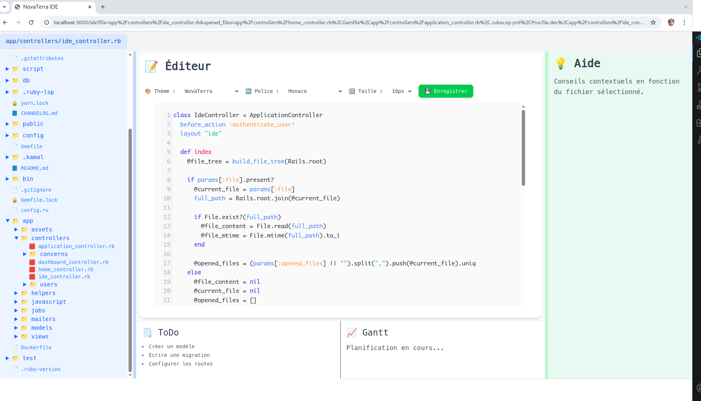

# 📜 CHANGELOG - NovaTerra-Hub

Ce fichier retrace l'évolution du projet NovaTerra-Hub, étape par étape, en toute transparence.

---

## [2025-04-21] Démarrage du projet

- Initialisation du projet Ruby on Rails 8
- Installation de TailwindCSS, Turbo, Hotwire
- Mise en place de l'environnement local sur Debian Linux
- Configuration de Git et création du dépôt GitHub

## [2025-04-22] Authentification utilisateur

- Installation de la gem `devise`
- Ajout du champ `username` aux utilisateurs
- Création de la page d'inscription et de connexion
- Gestion des sessions avec Devise

## [2025-04-23] Première version de la page d'accueil publique (Home#index)

- Présentation de NovaTerra : Pourquoi, Qui sommes-nous
- Définition claire de la mission et des valeurs
- Comparaison NovaTerra vs plateformes classiques
- Mini-parcours d'apprentissage en 4 étapes
- Témoignages utilisateurs fictifs
- Appel à l'action pour l'inscription
- Construction du Dashboard personnel (après connexion)
- Ajout du redimensionnement des panneaux dans l’IDE
- Intégration de la coloration syntaxique dans l’éditeur de code

---

## 📈 Prochaines étapes prévues

- Mise en place du mini-IDE intelligent Rails MVC
- Première version du mentor virtuel
- Structuration des parcours Débutant / Intermédiaire / Expert

